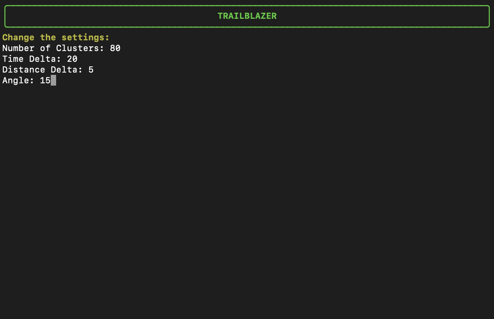

# TrailBlazer

A trailblazer is someone who marks a trail through unexplored territory. In the spirit of these pioneers, you are about to start a journey through the beautiful lands of our country. Our application, TrailBlazer, will be your trusty guide, designed to help you uncover the shortest routes to our historical treasures. Whether you're a tourist eager to discover iconic monuments, a local seeking a rural adventure, or a history enthusiast, TrailBlazer is the perfect tool for you. So what are you waiting for? Start your adventure and become the pioneer of your own trail!

## Getting Started

Our application is divided into parts: the `segments.py` module and the `monuments.py` module are the ones that we obtain information from. The `segments.py` module is responsible for finding all possible routes that can be taken in a certain area, while the `monuments.py` module is responsible for downloading the requested monuments. Then we have modules that build on the information obtained. The `graphmaker.py` module creates the graph that connects all the segments, and the `viewer.py` module is responsible for visualizing the results. In the `main.py` module, the user interface and control flow of the application are implemented. The `main.py` module is the one that the user interacts with, and it is the one that calls all the other modules to get the desired results.

### Prerequisites

In order to be able to use the modules provided, you first have to download the following python libraries. You can find the exact versions of the libraries in the `requirements.txt` file. The libraries are:

- `requests` to download ata files
- `gpxpy` to read GPX files
- `beautifulsoup4` to read HTML trees
- `simplekml` to write KMl files
- `networkx` to work with graphs
- `scikit` to cluster points
- `haversine` to calculate distances
- `staticmap` to draw maps
- `rich` for the terminal formatting
- `turfpy` to create the bounding box
- `geojson` to manipulate geojson files

### Installing

To install the required libraries, you can run the following command in your terminal:

```bash
pip3 install -r requirements.txt
```

Alternatively, you can install the libraries one by one by running `pip3 install <library_name>`.

### Observations

Even though some of these libraries are not Python standard libraries, we have checked in with the professors who have allowed their use. The libraries are not used to make the backbone of the program, but to present the results in a more user-friendly and interactive way. The program would be able to run without these libraries. But our approach to try to make it as similar to an application makes it so that these libraries are required.

## Implementation

To make the implementation clearer, the application has been divided into different modules, each with a specific function. To understand the implementation of the application, we have to understand each step that the program takes to get the desired results. The process that the program follows is:

### Finding the segments

The objective of the `segments.py` module is to find all the possible routes that can be taken in a certain area. We have separated this process into two parts. The first part to download all the points in a certain area, and the second part to find the segments that connect the points.

To download the points we use the `requests` library to download the data from the website [OpenStreetMap](https://www.openstreetmap.org/) and then we use the `gpxpy` library to read the GPX files. We save the points in a file. The information each point stores is: latitude, longitude, time, track and page number. We have decided to save the points in a file so that we don't have to download them again if we want to change the parameters of the graph.

To find the segments we use the points that have been downloaded. Given that we have a large number of geolocated points, we perform clustering to identify a subset of points representative of the analysed trails. We use the `sklearn` library to perform the Kmeans clustering. Once we have the clusters, we find the segments that connect the points. A segment is created if two points fulfill the following conditions:

- The distance and time between them is less than a certain threshold

- They have the same track and page number

- They belong to different clusters

Parameters like the distance and time delta can be found in the the settings file. The user can change these parameters to get the desired results. Once we check all the points, we then save the segments in a file. The function `get_segments` is the one that the user interacts with, and it is the one that calls the other functions to get the desired results. We have also implemented a function that shows the segments in a PNG file using the `staticmap` library. Below you can see the implementation of the `segments.py` module.

#### `segments.py` module

```python3
from typing import TypeAlias

@dataclass
class Point:
    lat: float
    lon: float
    def __hash__(self) -> int:

@dataclass
class Segment:
    start: Point
    end: Point

@dataclass Box:
    bottom_left: Point
    top_right: Point
    def __str__(self) -> str:

Segments: TypeAlias = list[Segment]
PointInfo: TypeAlias = list[tuple[float, float, datetime, int, int]]

def _download_points(box: Box, filename: str) -> None:
    """Download all points in the box and save them to the file."""

def _load_points(box: Box, filename: str) -> PointInfo:
    """Load points from the file."""

def download_segments(box: Box, filename: str) -> None:
    """Download all segments in the box and save them to the file."""

def load_segments(filename: str) -> Segments:
    """Load segments from the file."""

def get_segments(box: Box, filename: str) -> Segments:
    """
    Get all segments in the box.
    If filename exists, load segments from the file.
    Otherwise, download segments in the box and save them to the file.
    """

def show_segments(segments: Segments, filename: str) -> None:
    """Show all segments in a PNG file using staticmap."""

```

### Creating the graph

The module `graphmaker.py` is in charge of creating the graph that connects all the segments that have been found. The module has three main functions. Firstly, we have the `make_graph` function, that uses the `networkx` library to create the graph from the segments. It checks if the graph is connected using the ``_is_connex` function.

Then there is the `simplify_graph` function that takes a graph and simplifies it without losing any relevant information. Imagine we have three groups connected by two edges: g1-g2-g3. If g2 has degree two (only two edges connected to it) and the angle between them is close to 180 degrees, we can remove B from the graph and connect A and C. The user can change the parameter epsilon that we use in the aforementioned condition: abs(180 - angle) < epsilon. The user can modify this parameter to get the desired results. Below you can see an example of how the graph is simplified.


The last function is `_angle_of` that calculates the angle between three points using `haversine`. This function is used in the `simplify_graph` function to calculate the angle between three points. Below you can see the implementation of the `graphmaker.py` module.

#### `graphmaker.py` module

```python3
import networkx as nx

def make_graph(segments: Segments) -> nx.Graph:
    """Make a graph from the segments."""

def simplify_graph(graph: nx.Graph, epsilon: float) -> nx.Graph:
    """Simplify the graph."""

def _angle_of(p1, p2, p3) -> float:
    """Calculate the angle between three points using haversine."""

```

### Finding the monuments

The module `monuments.py` is the one in charge of downloading all of the monuments and then formatting their location and saving them onto a text file so that the program can use them.

The main part of this module is the `download_monuments` function. This function takes a string as an argument, which is the type of monument the user wants to download. The function then downloads the requested monuments from the website [Catalunya Medieval](https://www.catalunyamedieval.es/). The function saves the monuments in a file with the name of the type of monument selected. To do so, the function uses some auxiliary functions, these are:

- `_process_monument` that downloads the monument from the link
- `_get_coordinates` that gets the coordinates correpondig to a monument from it's text
- `_location_to_point` that converts the location from hexadecimal to a point

In order to make the download faster, we have implemented concurrent downloads using the `concurrent.features`. This way the program can download multiple monuments at the same time, making the process faster. In the download monuments function, we have also implemented a progress bar using the `rich` library, so that the user can see the progress of the download.

The module also has a function called `load_monuments` that loads the monuments from a file, and a function called `get_monuments` that gets all the monuments from a file. This function checks if the file exists, and if it does, it loads the monuments from the file. Otherwise, it downloads the monuments and saves them to the file. Below you can see the implementation of the `monuments.py` module.

#### `monuments.py` module

```python3
@dataclass
class Monument:
     name: str
     location: Point

Monuments: TypeAlias = list[Monument]

def _process_monument(mon: BeautifulSoup) -> Monument | None:
    """Download the monument from the link."""

def download_monuments(type: str) -> Monuments:
    """Download monuments from Catalunya Medieval."""

def _get_coordinates(text: str) -> Point:
    """Get the coordinates from a text."""

def _location_to_point(loc: str) -> Point:
    """Convert location to a point."""

def load_monuments(filename: str) -> Monuments:
    """Load monuments from a file."""

def get_monuments(filename: str) -> Monuments:
    """
    Get all monuments in the box.
    If filename exists, load monuments from the file.
    Otherwise, download monuments and save them to the file.
    """

```

### Finding the routes

Once all the information has been extracted, the `routes.py` module is in charge of finding the shortest path to the monuments selected. In order to do so, we first implemented a class called routes that has the following attributes:

- `graph` that is the graph that connects all the segments
- `start` that is the starting point of the route
- `endpoints` that is a list of all the monuments selected

The class has a method called `dist` that calculates the distance between the starting point and a certain endpoint.

The main function of the monuments is the `find_routes` function. This function takes the graph, the starting point and the endpoints as arguments. The function then finds the shortest path between the starting point and all the endpoints. The function uses the `networkx` library to find the shortest path. The function then creates a graph only using the shortest path and saves it to an object of the class `Routes`. The function then returns the object.

The module also has two functions that export the graph to a PNG file and a KML file. The `export_PNG_routes` function uses the `staticmap` library to export the graph to a PNG file. The `export_KML_routes` function uses the `simplekml` library to export the graph to a KML file.

The implementation of these two functions will be explained in the next section. As it is the `viewer.py` module that is in charge of visualizing the results.

Below you can see the implementation of the `routes.py` module:

#### `routes.py` module

```python3
class Routes:
    "Create a class that stores all shortest paths to a Monument, make it a graph."
    graph: nx.Graph
    start: Point
    endpoints: Monuments

    def __init__(self, start, endpoints) -> None:

    def dist(self, end: Monument) -> float:

def find_routes(graph: nx.Graph, start: Point, endpoints: Monuments) -> Routes:
    """Find the shortest route between the starting point and all the endpoints."""

def export_PNG_routes(routes: Routes, filename: str) -> None:
    """Export the graph to a PNG file using staticmap."""

def export_KML_routes(box: Box, routes: Routes, filename: str) -> None:
    """Export the graph to a KML file."""

```

### Visualizing the results

The `viewer.py` helps visualize the results by transforming the data given into either a PNG file or a KMl file. The PNG file is a map that shows the route that has been found, and the KMl file is a file that can be opened in Google Earth to visualize the route in 3D. It implements two functions, `export_png` and `export_kml` that take the graph that has been found and then export it into the desired format.

The `export_PNG` function uses the `staticmap` library to export the graph to a PNG file. It works by creating a map with all of the nodes from a `networkx` and then draws all of the graphs edges. The function then saves the map to a PNG file.

The `export_KML` function uses the `simplekml` library to export the graph to a KML file. It works by creating a KML file with all of the nodes and then their connecting edges. The function then saves the KML file.

All the files are saved in a folder with the box name that is created in the same directory as the program.

Below you can see the implementation of the `viewer.py` module:

#### `viewer.py` module

```python3
def export_PNG(box: Box, graph: nx.Graph, filename: str) -> None:
    """Export the graph to a PNG file using staticmaps."""

def export_KML(box: Box, graph: nx.Graph, filename: str) -> None:
    """Export the graph to a KML file."""

```

### User interface

The `main.py` module is the one in charge of interacting with the user. In order to do so, we have implemented a series of functions that make the program easier to read. Each of these functions have a certain purpose, and they are mainly used to build a user interface that is easy to use. They are also used to get the necessary information from the user in order to be able to get the desired results.

We will now breafly explain each of these functions and why we have implemented them:

- `_closest_point`: Finds the closest node to a given point. This function is used in the `main` function to find the closest point in the graph to the user's current location.

- `_closest_edge`: Finds the closest edge to a monument. This function is used in the `main` function. It then adds the edge to the graph.

- `_monuments_in_box`: Returns the monuments in the given box. This function is used in the `main` after choosing the type of monument to visit.

- `_welcome_menu`: Used in the `main` function to show the main menu to the user.

- `_select_monuments`: Lets you select which type of monument a user would like to visit. It then downloads all of the monuments of a certain type. If you want to download more that one type, you have to type all the wanted types separated by a `+`. Using the library `rich` we have implemented a progress bar that shows the progress of the download.

- `_get_current_location`: Used in the `main` function to get the user's current location. It checks if the location is valid and then returns it.

- `_generate_box`: Used in the `main` function to generate a box around the user's current location. It uses the `turfpy` library to generate a bounding circle which we then convert to a box.

- `_settings_menu`: Used in the `main` function to show the settings menu to the user. It shows the current settings and then asks the user if they want to change them.

- `_change_settings`: Used in the `main` function to change the graph's parameters. It asks the user to input the desired parameters and then asserts that they are valid. If so, it changes the parameters. It uses a implemented class called `Settings` that stores the parameters.

- `_save_file`: Used in the `main` function to save the settings to a file. It saves the settings to a file called `settings.txt`.

- `_new_folder`: Used in the `main` function to create the folders if they do not exist. It creates a folder with the name of the box. So that the results can be saved there.

- `_is_connex`: Used in the `main` function to check if the graph is connected. It returns a boolean value.

The `main` function is the one that the user interacts with. It is the one in charge of making sure the user gets their desired results.
It accesses the rest of the modules in order to make sure the user gets their desired routes and a way to see them.

Below you can see the implementation of the `main.py` module:

#### `main.py` module

```python3
console = Console()

class Settings:
    time_delta: int
    distance_delta: float
    n_clusters: int
    angle: int

    def __init__(self) -> None:

def _closest_point(graph: nx.Graph, point: Point) -> Point:
    """Find the closest point to the given point."""

def _closest_edge(m: Monument, segments: Segments) -> Segment:
    """Find the closest edge to the monument."""

def _monuments_in_box(m: Monuments, box: Box) -> Monuments:
    """Get the monuments in the box."""

def _welcome_menu() -> str:
    """Shows the main menu."""

def _select_monuments(options: str) -> Monuments:
    """Select the option."""

def _get_current_location() -> Point:
    """Get the user's current location."""

def _generate_box(point: Point) -> Box:
    """Generate a box around the point."""

def _settings_menu(settings: Settings) -> None:
    """Shows the settings menu, where the user can choose the parameters for the graph."""

def _change_settings(settings: Settings, invalid: bool) -> None:
    """Change the graph's parameters."""

def _save_file(settings: Settings) -> None:
    """Save the settings to a file."""

def _new_folder(box: Box) -> bool:
    """Create the folders if they do not exist."""

def _is_connex(graph: nx.Graph, box: Box) -> bool:
    """Check if the graph is connected."""

def main() -> None:
    """Main function."""

if __name__ == "__main__":
    main()

```

## Usage

To start the application, you have to run the `main.py` module. The user will be presented with a menu that has the following options: from 1-4 the user can choose what kind of monument they would like to visit. More than one option can be selected. To correctly choose the monuments, the user must enter the number of the monument he or she wishes to visit, separating each option with a '+'.

### Menu


Another option the user has is to preview or change the parameters by selecting option 5. Once selected, a new menu will appear, where the current settings are displayed. There, the user can decide if they want to change the settings or go back to the main menu. To do the later the user must press enter or write n. By pressing 'y' a series of questions will appear, asking the user to input the desired parameters. The user can decide the number of clusters, the time and distance delta and the angle. These parameters will be explained in the implementation section.

### SettingsMenu


### ChangeSettings



Back to the main menu. Once the monuments have been selected, the user will have to wait while the program downloads the monuments desired. A progress bar will appear, showing the progress of the download. Once the process is complete, the user is asked to give their location in the form of coordinates and the distance they are willing to walk. (If the user wishes to exit the application, they can write 'q' on any of the questions). The program will then find the shortest path to the monuments selected and show the results. This results can be found in a folder with the same name as the box that will be created in the same directory as the program. The results will be in the form of a PNG file and a KML file. With this, our application is complete, and the user can now explore the monuments they have selected. To exit the program, the user must select option 6.


### Final notes

To ease the process of testing the program, we recommend the user to select options 1+2 (military and religious monuments) to see how the program downloads the monuments. This should take just a few minutes. Then write the following coordinates as your location: 42.437775, 1.930466. This is a location in Puigcerda and a good example of how the program works will be shown. We recommend the user to select a distance of 3.0. This way the user will be able to see the results in a short amount of time.

## Example

There is an example of how the program works in the `example` folder. It is a box that was picked by choosing the location of the UPC in Terrassa. The user used number of clusters 90, time delta 20, distance delta 4.0 and angle 20. The user selected the options 1+2 (military and religious monuments). The user then selected the location 41.5665, 2.0153 and a distance of 5.0.

## Additional features

While using the program, you will find that if you select the same type of monuments, you don't have to go over the process of downloading the monuments again, as the program will use the monuments that have already been downloaded. This is because the program saves the monuments in a file with the name of the type of monument selected. This way, the program can use the monuments that have already been downloaded.

In regards to the `main.py`module, we have also implemented a function to check if a box (1) has been used twice. If you choose the same box but you have changed the parameters, the program will run again to get the segments, but time will be saved as the points have already been downloaded.

(1) A box is a geographical area that the user selects to find the monuments and the shortest path to them. It is defined by the user's location and the distance they are willing to walk.

## Inconsequential errors

If you try and run the program with `mypy` you will get some errors, becasue some of the libraries we have used are not typed. This is not a problem as the program runs perfectly fine.

## License

This project is licensed under the MIT License - see the [LICENSE.md](LICENSE.md) file for details.

## Acknowledgments

We would like to thank our teachers, Jordi Petit, Jordi Cortadella and Pau Fernández for their help and guidance throughout the project. We would also like to thank the authors of the libraries we have used, as they have made our work easier. Finally, we would like to thank the authors of the websites we have used to download the data, as they have made our work possible.

## Contributions

Contributions are welcome! For bug reports or requests please submit an issue. For code contributions please create a pull request. Thank you!

## Authors

Daniel Salazar & Nicolás Villoria
